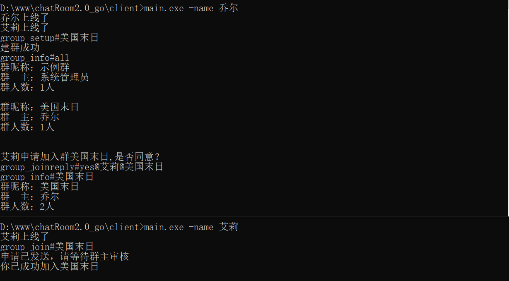

# 多人聊天室
- 用户昵称新建

  

- 新建群；包括群主、群昵称、群成员；group_setup#群名

  

- 查看群信息：group_info#群名（all:所有群信息）

  

- 群内发消息 all#消息

  

- 申请加群：group_join#群名

- 加群审核：服务端将加群信息转发给群主，由群主确认，有服务端转发结果；group_joinreply#yes(no)@申请人@群名

  

- 点对点发消息 昵称#消息

  

- 客户端的文件上传；upload#文件名#文件路径

  

  

